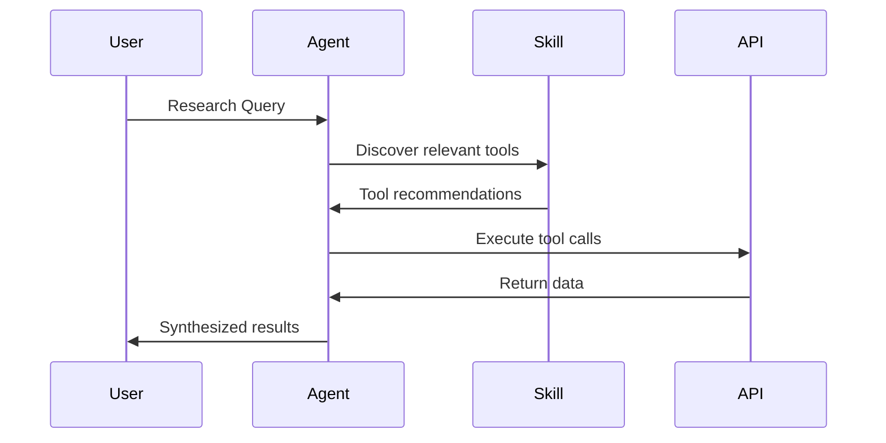

# System Patterns

## Architecture Overview

```mermaid
graph TB
    subgraph AI Platforms
        KC[KiloCode]
        CU[Cursor]
        CL[Claude]
        GH[GitHub Copilot]
    end
    
    subgraph Configuration Layer
        AG[AGENTS.md]
        OC[opencode.json]
        ENV[.env]
    end
    
    subgraph Skills Layer
        TU[ToolUniverse Skills]
        TS[Tool Skills]
        SS[Scientific Skills]
    end
    
    subgraph External APIs
        PC[PubChem]
        CH[ChEMBL]
        CT[ClinicalTrials.gov]
        PD[Protein Data Bank]
    end
    
    AI Platforms --> Configuration Layer
    Configuration Layer --> Skills Layer
    Skills Layer --> External APIs
```

## Design Patterns

### 1. Skill-Based Architecture
Each skill follows a consistent structure:
```
skill-name/
├── SKILL.md           # Main skill definition and instructions
├── README.md          # Usage documentation
├── EXAMPLES.md        # Example workflows
├── CHECKLIST.md       # Validation checklist
├── python_implementation.py  # Optional Python implementation
└── references/        # Additional reference materials
```

### 2. Configuration Pattern
- **Centralized Config**: `opencode.json` defines model and provider settings
- **Environment Variables**: `.env` stores API keys and secrets
- **Agent Instructions**: `AGENTS.md` provides coding standards and operational rules

### 3. Multi-Platform Support Pattern
The workspace supports multiple AI platforms through:
- Platform-specific directories (`.kilocode/`, `.cursor/`, `.claude/`, etc.)
- Symlinked skills directories
- Shared configuration via `AGENTS.md`

## Key Technical Decisions

### Decision 1: ToolUniverse as Primary Tool Provider
- **Context**: Need for comprehensive scientific tooling
- **Decision**: Integrate ToolUniverse MCP server for access to 10,000+ tools
- **Consequences**: Requires API key configuration but provides extensive capabilities

### Decision 2: Skill-Based Extensibility
- **Context**: Different research domains need specialized workflows
- **Decision**: Create domain-specific skills with consistent structure
- **Consequences**: Easy to add new domains while maintaining consistency

### Decision 3: Multi-Agent Configuration
- **Context**: Team uses different AI coding assistants
- **Decision**: Maintain configurations for multiple platforms
- **Consequences**: Increased maintenance but broader accessibility

## Data Flow Patterns

### Research Workflow Pattern


### Tool Discovery Pattern
1. Agent receives research query
2. Agent uses `Tool_Finder_Keyword` to discover relevant tools
3. Agent reviews tool documentation in SKILL.md
4. Agent executes multi-hop tool calls to gather comprehensive data
5. Agent synthesizes results into actionable insights

## Error Handling Patterns

1. **API Failures**: Skills implement fallback mechanisms and retry logic
2. **Rate Limiting**: Built-in throttling for API compliance
3. **Data Validation**: Input/output validation at skill boundaries

## Security Patterns

1. **API Key Management**: Keys stored in `.env`, never committed to version control
2. **Output Sanitization**: Patient data and sensitive information handled appropriately
3. **Access Control**: Skills respect API terms of service

---

*Last Updated: 2026-02-16*
