# ToolUniverse Common Workflows

This document outlines common research workflows using ToolUniverse skills.

---

## Drug Discovery Workflows

### Workflow 1: Comprehensive Drug Research

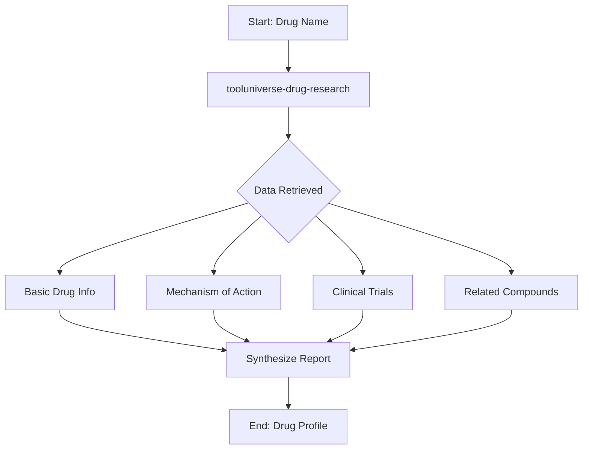

**Steps:**
1. Start with `tooluniverse-drug-research` skill
2. Retrieve compound data from PubChem
3. Get mechanism data from ChEMBL/DrugBank
4. Query ClinicalTrials.gov for trial status
5. Find related compounds and analogs
6. Synthesize comprehensive drug profile

**Example Query:**
```
Research the drug imatinib, including its mechanism of action, 
approved indications, ongoing clinical trials, and related compounds.
```

---

### Workflow 2: Drug Repurposing Analysis

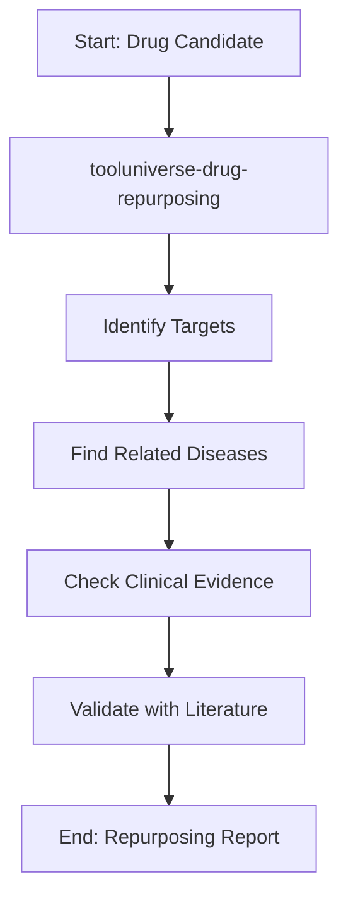

**Steps:**
1. Use `tooluniverse-drug-repurposing` skill
2. Identify known drug targets
3. Find diseases associated with targets
4. Check for existing clinical evidence
5. Validate with literature search
6. Generate repurposing opportunities report

---

### Workflow 3: Drug-Drug Interaction Analysis

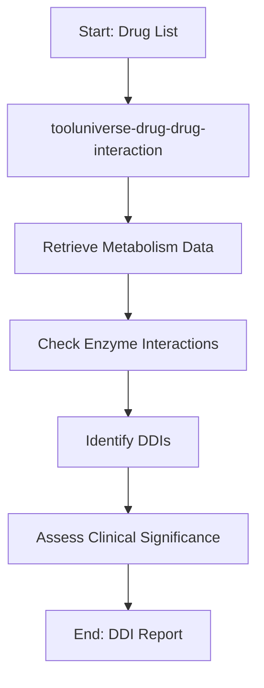

**Steps:**
1. Use `tooluniverse-drug-drug-interaction` skill
2. Retrieve metabolism pathways for each drug
3. Check for enzyme inhibition/induction
4. Identify potential interactions
5. Assess clinical significance
6. Generate DDI report with recommendations

---

## Target Research Workflows

### Workflow 4: Target Identification

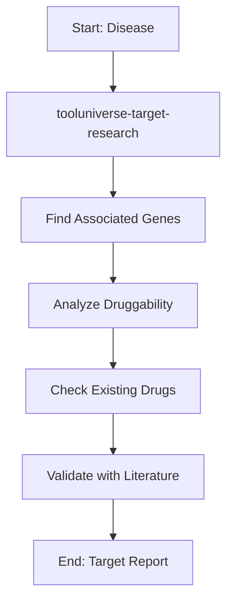

**Steps:**
1. Use `tooluniverse-target-research` skill
2. Query disease-gene associations
3. Analyze protein druggability
4. Check for existing targeted drugs
5. Validate with literature
6. Prioritize targets for further investigation

---

## Clinical Development Workflows

### Workflow 5: Clinical Trial Design

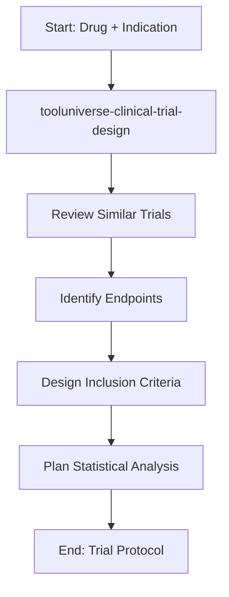

**Steps:**
1. Use `tooluniverse-clinical-trial-design` skill
2. Review similar completed/ongoing trials
3. Identify appropriate endpoints
4. Design inclusion/exclusion criteria
5. Plan statistical analysis approach
6. Generate protocol outline

---

### Workflow 6: Pharmacovigilance Analysis

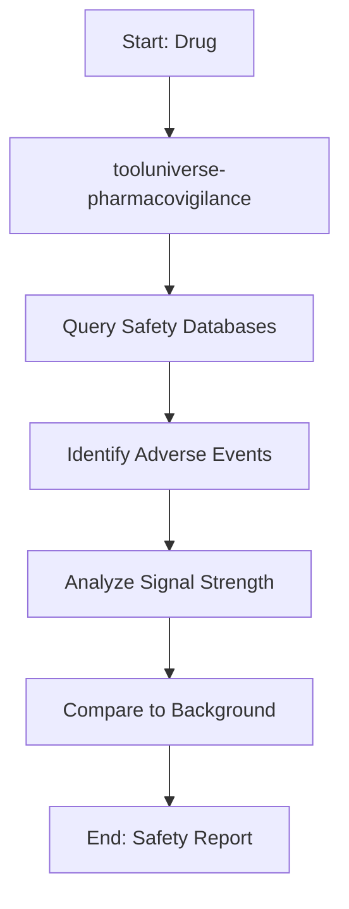

**Steps:**
1. Use `tooluniverse-pharmacovigilance` skill
2. Query FAERS/EudraVigilance databases
3. Identify reported adverse events
4. Analyze signal strength (disproportionality)
5. Compare to background rates
6. Generate safety signal report

---

## Bioinformatics Workflows

### Workflow 7: CRISPR Screen Analysis

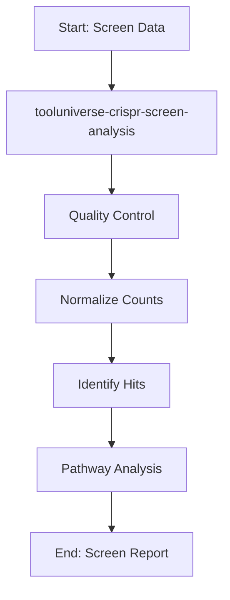

**Steps:**
1. Use `tooluniverse-crispr-screen-analysis` skill
2. Perform quality control on read counts
3. Normalize between samples
4. Identify significant hits (genes)
5. Perform pathway enrichment analysis
6. Generate comprehensive screen report

---

### Workflow 8: Rare Disease Diagnosis

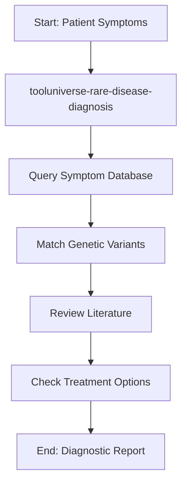

**Steps:**
1. Use `tooluniverse-rare-disease-diagnosis` skill
2. Query disease-symptom associations
3. Match genetic variants to phenotypes
4. Review supporting literature
5. Check for available treatments
6. Generate diagnostic support report

---

## Protein Engineering Workflows

### Workflow 9: Antibody Engineering

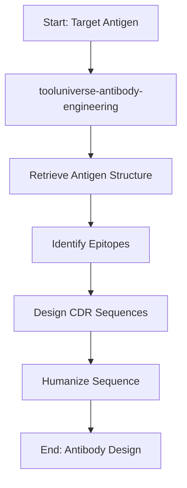

**Steps:**
1. Use `tooluniverse-antibody-engineering` skill
2. Retrieve antigen 3D structure
3. Identify potential epitopes
4. Design complementary CDR sequences
5. Humanize antibody sequence
6. Generate antibody design report

---

### Workflow 10: Protein Structure Retrieval

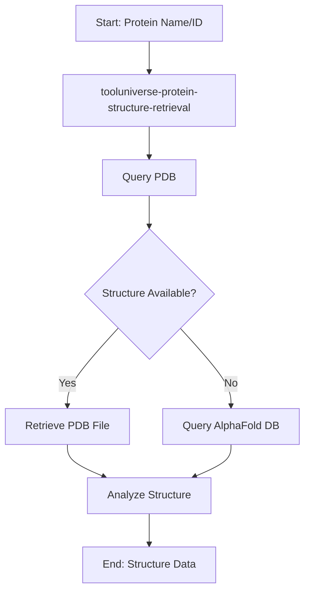

**Steps:**
1. Use `tooluniverse-protein-structure-retrieval` skill
2. Query PDB for experimental structures
3. If not available, query AlphaFold DB
4. Retrieve structure file
5. Perform basic structural analysis
6. Return structure data and analysis

---

## Literature Research Workflows

### Workflow 11: Deep Literature Research

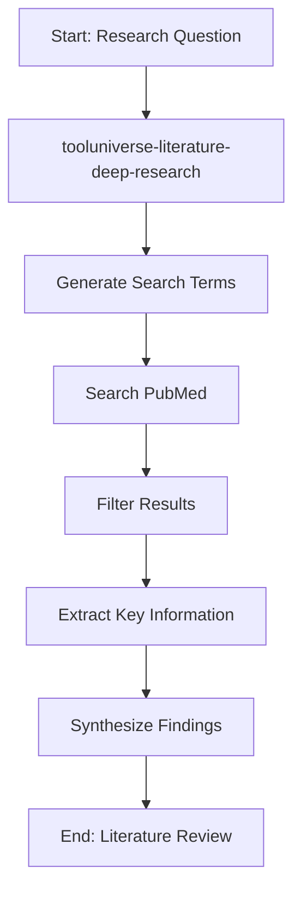

**Steps:**
1. Use `tooluniverse-literature-deep-research` skill
2. Generate comprehensive search terms
3. Search PubMed and other databases
4. Filter by relevance and quality
5. Extract key information from papers
6. Synthesize into literature review

---

## Multi-Step Research Example

### Comprehensive Drug Development Research

This example combines multiple workflows for a complete drug development analysis:

```
Research Question: Evaluate the potential of repurposing imatinib for COVID-19 treatment.

Step 1: Drug Research
- Use tooluniverse-drug-research to understand imatinib's mechanism
- Identify known targets (BCR-ABL, KIT, PDGFR)

Step 2: Target Research  
- Use tooluniverse-target-research to connect targets to COVID-19
- Research if targets are involved in viral entry/replication

Step 3: Literature Research
- Use tooluniverse-literature-deep-research
- Search for existing studies on imatinib and COVID-19

Step 4: Clinical Trial Check
- Use tooluniverse-clinical-trial-design
- Check for ongoing COVID-19 trials with imatinib

Step 5: Safety Analysis
- Use tooluniverse-pharmacovigilance
- Review safety profile for potential COVID-19 patients

Step 6: Synthesis
- Compile all findings into comprehensive report
- Provide recommendations for further investigation
```

---

## Best Practices

1. **Start with the right skill** - Match your research question to the appropriate skill
2. **Use multiple tools** - Comprehensive research requires multiple data sources
3. **Validate findings** - Cross-reference results across databases
4. **Document everything** - Keep track of queries and results for reproducibility
5. **Iterate as needed** - Initial results may prompt additional queries

---

*Last Updated: 2026-02-16*
